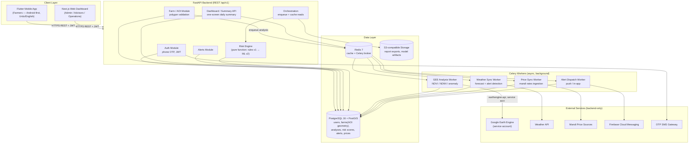

# 01 — System Architecture

## High-Level Component Diagram



## Layer Responsibilities

### 1. Client Layer
| Component | Role |
|---|---|
| **Flutter app** | The farmer product. Offline-tolerant, low-bandwidth, Urdu-first. Renders decisions, never raw indices. Map is optional (pin + radius fallback). |
| **Next.js web** | Admin/advisor/operations panels: farm monitoring views, analytics, advisor client lists (Phase 2+). |

Clients talk **only** to the FastAPI backend over REST `/api/v1` with JWT. They have zero credentials for GEE, weather, or price sources.

### 2. API Layer (FastAPI)
- **Auth** — phone + OTP → JWT access/refresh; rate limiting.
- **Farm/AOI** — CRUD, polygon validation (self-intersection, area limits), triggers analysis enqueue.
- **Dashboard/Summary** — composes weather + crop health + prices + risk into **one response** for the daily summary screen (the app's core endpoint).
- **Risk Engine** — pure scoring function: `(indices, forecast, crop, season) → {level, reasons[], action}`. Rules-based in v1; the ML disease model (Phase 2) plugs in behind the same interface.
- **Orchestration** — enqueue Celery jobs, read-through cache, never blocks a request on an external call.

### 3. Worker Layer (Celery)
All external I/O lives here, away from the request path:
- **GEE worker** — batches AOIs (`reduceRegions()`), computes NDVI/NDWI/anomaly, stores summaries.
- **Weather worker** — scheduled sync per district; evaluates alert thresholds.
- **Price worker** — ingests mandi rates; stamps "as of" times.
- **Alert worker** — dispatches FCM pushes + writes in-app alerts.

### 4. Data Layer
- **PostgreSQL + PostGIS** — single source of truth. `farms.geom` is a PostGIS `MultiPolygon` (SRID 4326). Spatial queries (district lookup, area calc) stay in the DB.
- **Redis** — response cache (dashboard payloads, prices) + Celery broker/result backend. Prevents repeated GEE calls.
- **S3-compatible storage** — report exports (Phase 2+), ML model artifacts.

## Key Architectural Decisions

| # | Decision | Rationale | Alternative rejected |
|---|---|---|---|
| AD-1 | **Modular monolith** (one FastAPI service, clear internal modules) | MVP speed, one deployable, low ops cost; modules split cleanly later if needed | Microservices — operational overhead with no MVP benefit |
| AD-2 | **GEE behind backend workers only** | Credential safety, quota control, caching, batch efficiency | Client-side GEE — exposes secrets, no cost control |
| AD-3 | **PostGIS over separate geo files** | Farm polygons are first-class queryable data; area/district math in SQL | GeoJSON in text columns / MongoDB |
| AD-4 | **Async analysis with cached reads** | GEE jobs take seconds-minutes; farmers need instant screens | Blocking API on GEE call |
| AD-5 | **Risk engine as pure function module** | Testable, explainable, swappable rules→ML without contract change | Scoring inside DB or inside the app |
| AD-6 | **Celery over RQ** | Mature retries, beat scheduling (weather/price sync), better production tooling | RQ — simpler but weaker scheduling |
| AD-7 | **REST + JSON over GraphQL** | Simple cacheable endpoints, low client complexity, low-bandwidth friendly | GraphQL — overkill for this client set |

## Risk Engine Contract (stable across phases)

```
inputs:  ndvi_mean, ndvi_anomaly, ndwi_mean,
         forecast (rain_mm_7d, tmax, tmin), crop_type, season, sowing_date?
output:  {
           level:    "low" | "medium" | "high",
           reasons:  [ {code, text_en, text_ur} ]  (max 3, ranked),
           action:   "irrigate" | "spray" | "wait" | "harvest" | "sell" | "consult_advisor"
         }
```
