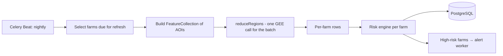

# 02 — Data Flow: Satellite Analysis Pipeline (GEE)

This is the core differentiating flow of Kisaan Dost: turning a farm boundary into an action recommendation.

## End-to-End Sequence

```mermaid
sequenceDiagram
    autonumber
    participant F as Farmer (Flutter App)
    participant API as FastAPI Backend
    participant Q as Redis (Celery Broker)
    participant W as GEE Worker
    participant G as Google Earth Engine
    participant R as Risk Engine
    participant DB as PostgreSQL + PostGIS
    participant N as Alert/FCM

    F->>API: POST /farms (name, crop, AOI polygon or pin+radius)
    API->>API: Validate polygon (no self-intersection, 0.1–2000 ha, SRID 4326)
    API->>DB: Save farm + geom
    API->>Q: Enqueue gee.analyze_farm(farm_id)
    API-->>F: 202 Accepted (farm created; analysis pending)

    W->>G: Authenticate (service account, initialized once per worker)
    W->>G: Sentinel-2 collection filtered by AOI + date range (cloud cover < 20%)
    G-->>W: ImageCollection
    W->>G: reduceRegion() — NDVI mean, NDWI mean per farm AOI
    W->>G: Anomaly vs multi-year baseline (same period, e.g. 5-yr mean)
    G-->>W: Index statistics
    W->>DB: Store aoi_analyses (ndvi_mean, ndwi_mean, anomaly, captured_at)

    W->>R: score(ndvi, ndwi, anomaly, forecast, crop, season)
    R-->>W: {level, reasons[], action}
    W->>DB: Store risk_scores
    W->>N: If level == high → dispatch alert
    N-->>F: Push: "⚠ High risk — [reason] — [action]"

    F->>API: GET /dashboard (opens app)
    API->>DB: Latest analysis + score + weather + prices
    API-->>F: 200 One-screen summary (status, reason, action, data dates)
```

## AOI Creation Flow (user-facing)

```mermaid
flowchart TD
    A[Farmer taps 'Add Farm'] --> B{How to mark location?}
    B -->|Comfortable with maps| C[Draw polygon on map]
    B -->|Map-optional path| D[Drop pin + radius slider]
    C --> E{Polygon valid?}
    D --> E2{Radius 0.1–2000 ha?}
    E -->|No| F[Show simple fix message<br/>(Urdu + English)]
    E2 -->|No| F
    F --> C
    E -->|Yes| G[Save AOI]
    E2 -->|Yes| G
    G --> H[Analysis enqueued —<br/>show 'first results within a day']
    H --> I[Push notification when ready]
```

## Caching & Refresh Strategy

Satellite data does not change in real time — the system must behave accordingly.

| Data | Source cadence | Cache policy |
|---|---|---|
| Sentinel-2 imagery | ~5-day revisit | Analysis per farm per **date**; never recompute for the same date. Next refresh when a new cloud-free scene exists. |
| Dashboard summary | Composite | Redis, TTL 15 min; invalidated when a new analysis/score is written. |
| Weather forecast | Hourly | Redis per district, TTL 1 h; alert evaluation on each sync. |
| Mandi prices | Daily (per source) | Redis per district+crop, TTL 6 h; every price row keeps its source timestamp. |

**Rule:** one GEE call per (farm, scene date). Redis stores the computed summary; the worker checks "is there a newer usable scene?" before invoking GEE at all.

## Batch Path (multi-farm / district refresh)



`reduceRegion()` for a single farm (on-demand), `reduceRegions()` for scheduled batch refreshes — this keeps GEE quota usage low.

## Failure Handling (summary — full policy in ERROR_HANDLING.md)

- GEE timeout/error → Celery retry ×3 with exponential backoff → job marked failed, ops alerted, **farmers keep seeing the last good summary with its original date**.
- Cloud-covered scene → keep previous analysis, log "no clear scene" reason.
- Weather API down → serve cached forecast flagged stale; alert evaluation pauses, app keeps working.
- Price source down → that source's rows stop updating; UI labels staleness per source.
