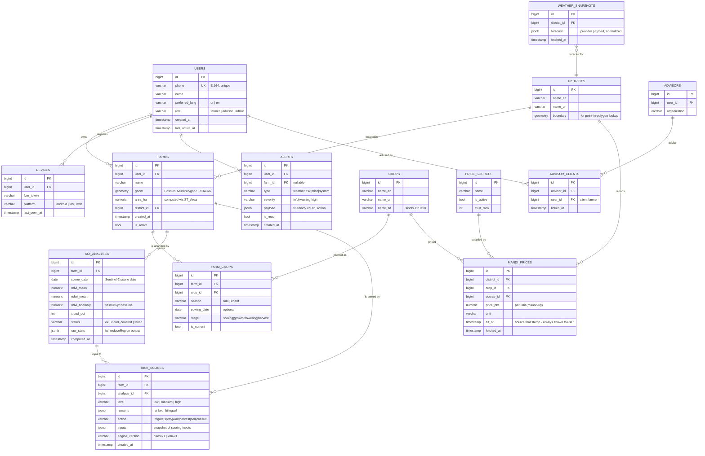

# 03 — Database Design (ERD)

PostgreSQL 16 + PostGIS 3.4. Geometry stored in **SRID 4326** (WGS84).

## Entity-Relationship Diagram



## Design Notes

1. **`farms.geom` is PostGIS geometry, not GeoJSON text.** Area (`ST_Area(geography(geom))`), district lookup (`ST_Within`), and batching (`ST_Union`) all happen in SQL.
2. **`aoi_analyses` is append-only** — full history is kept, enabling Phase-2 trend charts without migration. One row per (farm, scene_date); unique index on `(farm_id, scene_date)`.
3. **`risk_scores.inputs` snapshots the scoring inputs.** A score must always be explainable even if live data has changed since.
4. **`engine_version` on every score** — rules-v1 and ML-v2 outputs coexist during rollout and A/B comparison.
5. **`mandi_prices.as_of` is the source's own timestamp** and must be surfaced in the UI ("rates as of …"). Stale rows (>48 h) are labeled, never deleted silently.
6. **OTP codes live in Redis** (with TTL + attempt counters), not in PostgreSQL — they are ephemeral.
7. **Auditing:** table above shows the MVP core; `audit_log` (user, action, entity, before/after) is added before first production release.
8. **Migrations via Alembic only** — no manual schema changes.

## Key Indexes (beyond PKs/FKs)

```sql
CREATE UNIQUE INDEX uq_analysis_farm_date ON aoi_analyses (farm_id, scene_date);
CREATE INDEX idx_farms_user ON farms (user_id) WHERE is_active;
CREATE INDEX idx_scores_farm_latest ON risk_scores (farm_id, created_at DESC);
CREATE INDEX idx_prices_lookup ON mandi_prices (district_id, crop_id, as_of DESC);
CREATE INDEX idx_alerts_user_unread ON alerts (user_id) WHERE is_read = false;
CREATE INDEX idx_farms_geom ON farms USING GIST (geom);  -- spatial queries
```
