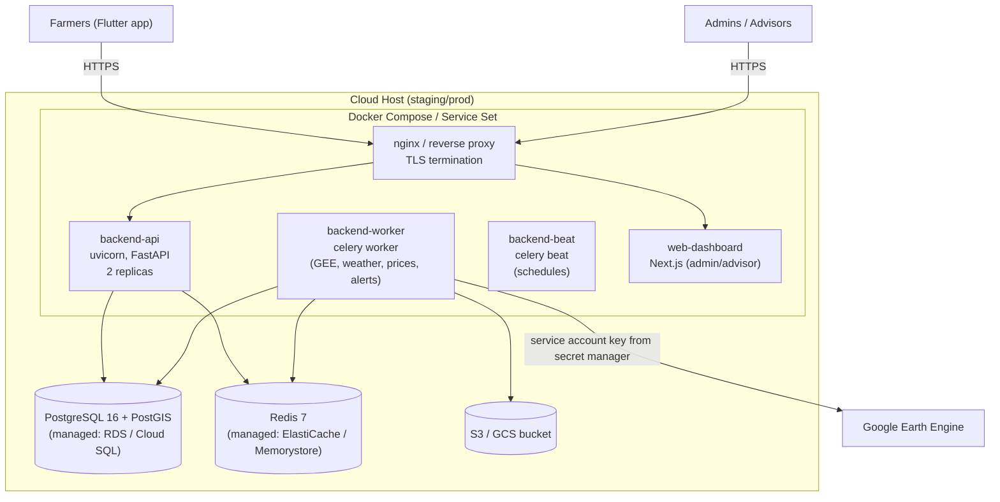

# 04 — Deployment & DevOps Architecture

## Environments

| Env | Purpose | Infra |
|---|---|---|
| **dev** | Local development | `docker compose up` on developer machine |
| **staging** | Integration + UAT, real GEE service account (test project) | Single small cloud instance (AWS EC2 / GCP e2-medium) |
| **prod** | Live traffic | Containerized, initially single node + managed DB |

> Keep it boring: **one host, Docker Compose (or ECS/Cloud Run service set) is enough for MVP**. Kubernetes is explicitly out until scale demands it (see RULES.md).

## Container Topology

**Why separate `worker` and `beat` containers:** GEE/Celery tasks are memory-hungry and restartable; the API stays lean. Scaling = add worker replicas only.

## CI/CD Pipeline (GitHub Actions)

```mermaid
flowchart LR
    P["PR opened"] --> L["Lint & type check<br/>ruff / mypy | dart analyze | tsc"]
    L --> T["Unit + integration tests<br/>pytest | flutter test | vitest"]
    T --> B["Build images<br/>(backend, web)"]
    B --> M["Merge to main"]
    M --> D["Deploy staging<br/>run Alembic migrations"]
    D --> S["Smoke test /farms, /dashboard, /health"]
    S -->|pass| PRD2["Manual approval<br/>(release tag)"]
    PRD2 --> PP["Deploy prod"]
    PP --> AL["Post-deploy:<br/>health check + Sentry release"]
```

- **Trunk-based:** short-lived feature branches → PR → main. Conventional commits.
- Migrations run automatically on staging, require the release pipeline on prod (gated).
- Images tagged with git SHA; rollback = redeploy previous tag.

## Configuration & Secrets

| Secret | Where it lives |
|---|---|
| GEE service-account JSON | Secret manager (AWS Secrets Manager / GCP Secret Manager) → mounted as env/file to **worker container only** |
| DB / Redis URLs | Secret manager → env vars |
| JWT signing key | Secret manager → env var |
| SMS gateway + FCM keys | Secret manager → env vars |
| Everything else | `.env` per environment (see root `.env.example`) |

**Rules:** no secrets in git (`.env` is git-ignored; `.env.example` documents keys only); no secrets reach the Flutter app or web bundle.

## Observability

| Concern | Tool (MVP) |
|---|---|
| Structured logs (JSON, `request_id` correlation) | structlog → stdout → cloud logging driver |
| Error tracking | Sentry (backend + Flutter + web) |
| Metrics (queue depth, job latency, GEE call count) | Celery events + Prometheus endpoint → Grafana or CloudWatch |
| Uptime | `/health` (liveness) + `/health/ready` (DB + Redis ping) probed by cloud monitor |
| Alerting (ops) | Worker failure rate, GEE quota usage, DLQ depth > 0, price feed stale > 48 h |

## Backup & DR (prod)

- PostgreSQL: automated daily snapshots + PITR (managed service default), 7-day retention.
- Redis: cache/broker only — no durable state; rebuildable.
- S3: versioning on.
- RPO 24 h / RTO 4 h for MVP — acceptable: satellite data is re-derivable, prices re-ingestible.
