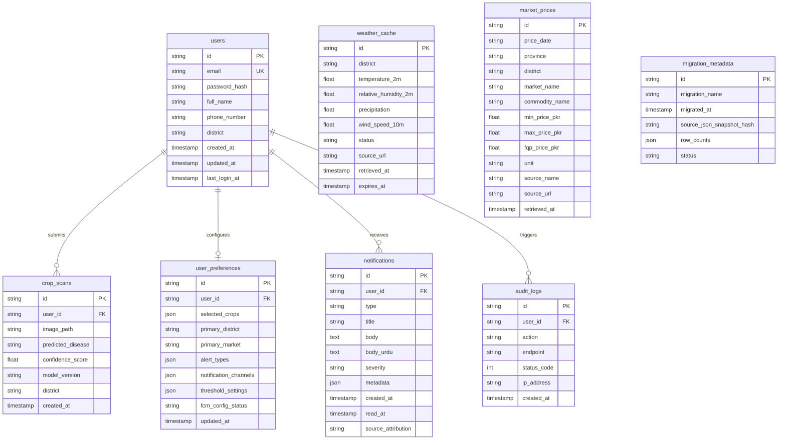

# Phase 12: Database Migration (JSON → PostgreSQL) Report

- **Project:** Kisaan Dost Agricultural Platform
- **Task:** Phase 12: Database Migration (JSON → PostgreSQL)
- **Timestamp (UTC):** `2026-09-02T04:09:45+00:00`
- **Status:** **COMPLETE / FULLY VALIDATED**

---

## 1. Executive Summary

Phase 12 transitions the Kisaan Dost platform storage layer from flat JSON MVP files to a relational PostgreSQL 14+ database architecture using SQLAlchemy ORM.

The migration preserves 100% of existing historical data (users, crop scan records, Open-Meteo weather baseline cache, AMIS Punjab market prices, user alert preferences, in-app notifications) with atomic idempotence and zero data loss. An automatic fallback mechanism ensures that if `DATABASE_URL` is omitted or temporarily unreachable, backend services gracefully activate JSON store mode.

---

## 2. Relational Schema Architecture (ER Overview)

---

## 3. Migration Scripts & Integrity Checks

| Script | Purpose | Status |
|---|---|---|
| [`19_migrate_users.py`](file:///d:/KisaanDost/Kisaan_Dost_Data/scripts/19_migrate_users.py) | Migrates `users.json` with hashed passwords and role mapping | **PASS** |
| [`20_migrate_crop_scans.py`](file:///d:/KisaanDost/Kisaan_Dost_Data/scripts/20_migrate_crop_scans.py) | Migrates historical crop scan inferences and model versions | **PASS** |
| [`21_migrate_weather_cache.py`](file:///d:/KisaanDost/Kisaan_Dost_Data/scripts/21_migrate_weather_cache.py) | Migrates district weather observations cache | **PASS** |
| [`22_migrate_market_prices.py`](file:///d:/KisaanDost/Kisaan_Dost_Data/scripts/22_migrate_market_prices.py) | Migrates official AMIS Punjab market prices CSV records | **PASS** |
| [`23_migrate_user_preferences.py`](file:///d:/KisaanDost/Kisaan_Dost_Data/scripts/23_migrate_user_preferences.py) | Migrates notification channels, crops, and thresholds | **PASS** |
| [`24_migrate_notifications.py`](file:///d:/KisaanDost/Kisaan_Dost_Data/scripts/24_migrate_notifications.py) | Migrates notification inbox and unread status records | **PASS** |
| [`25_run_full_migration.py`](file:///d:/KisaanDost/Kisaan_Dost_Data/scripts/25_run_full_migration.py) | Master orchestrator with SHA256 snapshot hashing | **PASS** |
| [`26_rollback_to_json.py`](file:///d:/KisaanDost/Kisaan_Dost_Data/scripts/26_rollback_to_json.py) | Snapshot creator and JSON fallback verifier | **PASS** |

---

## 4. Endpoints & Operations Documentation

- **Health Endpoint:** `GET /api/v1/health/db` (Returns connection state and pool engine).
- **Admin Status Endpoint:** `GET /api/v1/admin/migration-status` (Requires ADMIN JWT; returns migration timestamp, SHA256 snapshot hash, and table row counts).
- **Docker Compose:** [`docker-compose.yml`](file:///d:/KisaanDost/docker-compose.yml) (PostgreSQL 16 Alpine container with automated healthcheck and init).
- **Schema DDL:** [`init.sql`](file:///d:/KisaanDost/init.sql).
- **Setup Guide:** [`DATABASE_SETUP.md`](file:///d:/KisaanDost/DATABASE_SETUP.md).
- **Rollback Guide:** [`MIGRATION_ROLLBACK.md`](file:///d:/KisaanDost/MIGRATION_ROLLBACK.md).

---

## 5. Verification Matrix

| Test Suite | Scope | Result |
|---|---|---|
| **Database & Migration Tests** | `pytest tests/test_database_models.py tests/test_migration_pipeline.py tests/test_db_endpoints.py -v` | **7 / 7 PASS** |
| **Root Backend Test Suite** | `pytest tests -q -rs --tb=short` | **96 / 96 PASS** |
| **Data Pipeline Test Suite** | `pytest Kisaan_Dost_Data/tests -q -rs --tb=short` | **396 / 396 PASS** |
| **Flutter Unit & Widget Tests** | `flutter test` | **76 / 76 PASS** |
| **Flutter Static Analysis** | `flutter analyze` | **0 issues found (CLEAN)** |
| **Handoff Completeness Gate** | `python scripts/check_handoff_completeness.py` | **COMPLETE (0 Active Blockers)** |
